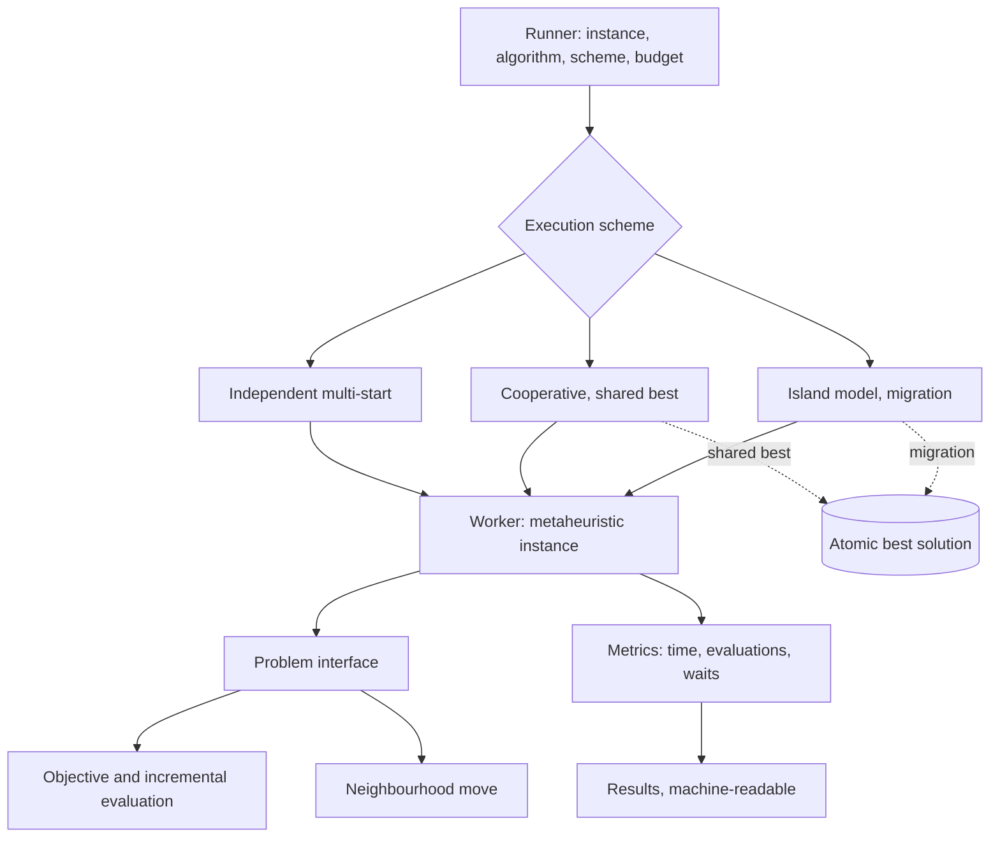

# Anneal

A parallel metaheuristics framework for combinatorial optimisation. Course project for
**Metaheuristics**, MEng in Computer and Software Engineering, Faculty of Computer Systems
and Technologies, Technical University of Sofia.

## What it is

Many practical scheduling, routing and packing problems are too large to solve exactly, so
they are attacked with metaheuristics: general search strategies that trade the guarantee of
optimality for a bound on running time. Anneal puts several of those strategies behind one
problem interface, runs them under several parallel execution schemes, and measures what
each combination actually costs. The point of the project is the measurement: speedup and
efficiency against thread count, solution quality against a fixed evaluation budget, and a
profiler-backed account of where the time goes.

## Goals

- One problem interface that a metaheuristic can use without knowing which problem it solves.
- Four metaheuristics behind it: simulated annealing, tabu search, a genetic algorithm, ant
  colony optimisation.
- Three parallel execution schemes: independent multi-start, cooperative with a shared best
  solution, island model with periodic migration.
- Reproducible runs: a fixed seed and a fixed thread count produce the same result.
- Benchmarks against published instances (TSPLIB, OR-Library) so results are comparable.
- A measurement methodology stated before any number is collected, not after.

## Technologies

| Technology | Version or standard | Why |
|---|---|---|
| C++ | ISO/IEC 14882:2020 (C++20) | Control over memory layout plus standard concurrency, so measurements reflect the algorithm rather than a runtime under it. |
| CMake | 3.20 or newer | Presets and multi-target builds; the library builds without the benchmarking dependencies. |
| `std::jthread`, `std::atomic` | C++20 standard library | Threads whose lifetime is tied to scope, and lock-free update of the shared best solution. |
| Google Benchmark | 1.8 or newer | Repetition counts, statistics and warmup handling that hand-rolled timing loops get wrong. |
| GoogleTest | 1.14 or newer | Correctness tests kept separate from timing tests. |
| Linux `perf` | distribution package | Hardware counters for cache misses and instructions per cycle on the hot path. |
| TSPLIB, OR-Library | public instance sets | Known optimal or best-known values, so solution quality is a relative gap and not an unscaled number. |

## Architecture

Four layers. The bottom one describes a problem: solution representation, objective
function, neighbourhood move, and an incremental evaluation of the change a move makes. The
metaheuristics sit above it and speak only to that interface. The execution schemes drive
several searches and decide what, if anything, they exchange. The top layer picks an
instance, a metaheuristic, a scheme and a stopping rule, and writes results in a
machine-readable form.



## Build

```bash
git clone <local path to this repository> anneal-metaheuristics
cd anneal-metaheuristics
cmake -S . -B build -DCMAKE_BUILD_TYPE=Release
cmake --build build -j
ctest --test-dir build --output-on-failure
./build/benchmarks/anneal_bench
```

## Documentation

The project report lives in `docs/` and is written in Bulgarian, because the subject is
taught in Bulgarian and the layout is normative for the faculty. It follows the TU-Sofia
FKST formatting rules: A4, Times metrics at 12pt, 1.5 line spacing, Roman-numbered section
headings, tables captioned above and figures captioned below.

```bash
cd docs
latexmk -pdf Main.tex   # output: docs/build/Main.pdf
```

Unfilled facts are marked with `\TODO{...}`. Find them with:

```bash
grep -rn 'TODO' docs/chapters docs/Main.tex docs/references.bib
```

## Status

- [x] Repository, build documentation scaffold, report skeleton
- [x] Bibliography of primary sources
- [ ] Problem interface
- [ ] Travelling salesman problem instance loader (TSPLIB)
- [ ] Simulated annealing
- [ ] Tabu search
- [ ] Genetic algorithm
- [ ] Ant colony optimisation
- [ ] Independent multi-start
- [ ] Cooperative scheme with shared best solution
- [ ] Island model
- [ ] Correctness tests
- [ ] Benchmark harness
- [ ] Profiling run and analysis
- [ ] Results chapter filled from measurements

Nothing in the results chapter is measured yet. Every number in it is a `\TODO`.

## License

MIT. See [LICENSE](LICENSE).
